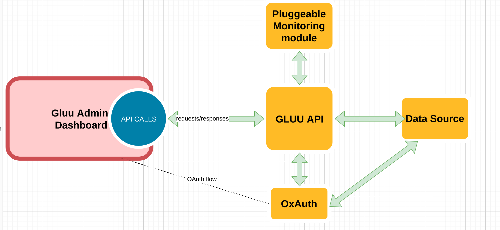

# INTRODUCTION

Oxtrust2 is a react based application that consumes services provide by the API project via REST calls.

# OVERALL ARCHITECTURE

Below is the architecture of the whole stack and the component highlight in red is what this project is.
 
 

# TOOLS USED

To have a lightweight, responsive, attracive  and simple application , we have choose a set of tools.

## DEV STACK 

**create-react-app** is used to ease the developement process and also the build process.

## UI LIBRARIES

we have decided to use the following UI libraries:
  1. **React-Shard**: https://material-ui.com/
  2. **react-bootstrap**: https://www.primefaces.org/primereact
  
## STATE MANAGEMENT

  **Redux**: https://redux.js.org/
  
## LOCALISATION

The UI will support by default three languages(fr, ru and en). 
**react-i18next**: https://github.com/i18next/react-i18next

## ROUTING

 For path routing, **react-router** is used.
 **React router**: https://reacttraining.com/react-router

## Date management

  Moment.js is used to manipulate dates.  
